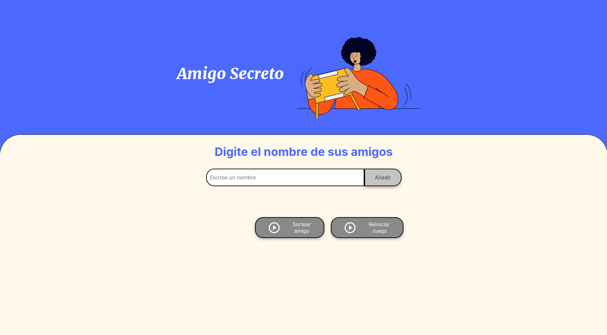

# Amigo Secreto - Sorteo de Nombres

Este es un proyecto en JavaScript que permite ingresar una lista de nombres y realizar un sorteo aleatorio para determinar un "Amigo Secreto".

## 📌 Características

- Permite agregar nombres a la lista.
- Muestra en pantalla la lista de nombres ingresados.
- Realiza un sorteo aleatorio entre los nombres ingresados.
- Permite reiniciar el sorteo para realizar uno nuevo.

## 🚀 Instalación y Uso

1. **Clonar el repositorio**:
   ```bash
   git clone https://github.com/Phylip28/challenge-amigo-secreto.git
   ```
2. **Abrir el archivo HTML en un navegador**.
3. **Ingresar nombres en el campo de entrada y hacer clic en "Agregar"**.
4. **Hacer clic en "Sortear" para elegir un ganador aleatorio**.
5. **Reiniciar el sorteo si se desea hacer otro**.

## 📜 Estructura del Proyecto

```
challenge-amigo-secreto/
│-- index.html
│-- styles.css
│-- script.js
│-- README.md
```

- `index.html` → Contiene la estructura del sitio.
- `styles.css` → Contiene los estilos del proyecto.
- `script.js` → Contiene la lógica del sorteo.
- `README.md` → Documentación del proyecto.

## 🛠️ Tecnologías Usadas

- HTML
- CSS
- JavaScript

## 📷 Vista Previa



## 📝 Autor

Creado por [Phylip28](https://github.com/Phylip28) 🚀

